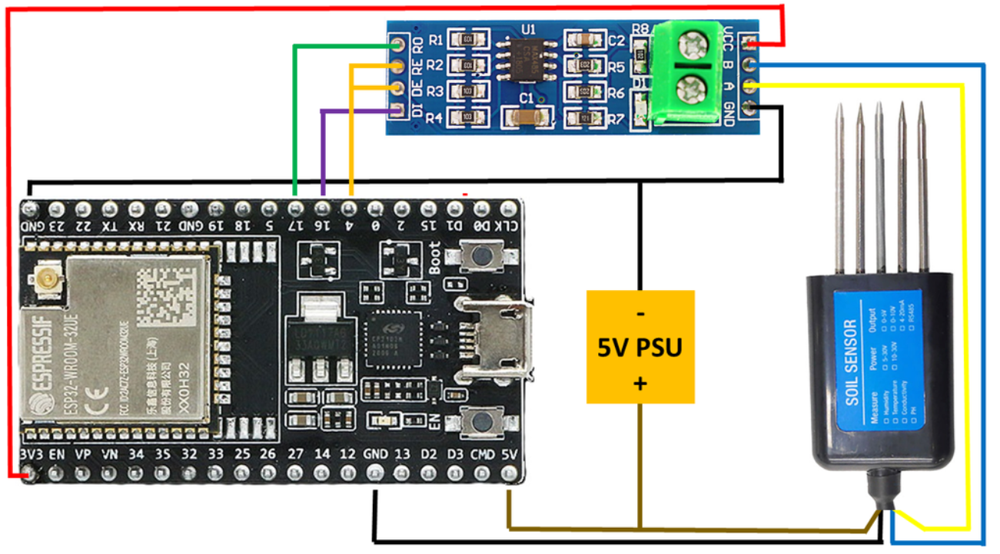

# Soil-Monitoring-System

This project implements a soil monitoring system using an ESP32 microcontroller and a 7-in-1 Modbus soil sensor. The system measures essential soil parameters, such as nitrogen (N), phosphorus (P), potassium (K), conductivity, pH, humidity, and temperature, and uploads the data to the ThingSpeak platform for remote monitoring.

## Table of Contents

- [Overview](#overview)
- [Features](#features)
- [Hardware Requirements](#hardware-requirements)
- [Software Requirements](#software-requirements)
- [Installation](#installation)
- [Usage](#usage)
- [Circuit Diagram](#circuit-diagram)
- [Contributing](#contributing)
- [License](#license)

## Overview

This project aims to provide real-time monitoring of soil health parameters to support agricultural decision-making. The system uses an ESP32 to read data from a Modbus sensor over RS485 and sends the data to ThingSpeak using WiFi for remote visualization.

## Features

- **Soil Parameter Monitoring**: Measures soil moisture, temperature, conductivity, pH, nitrogen, phosphorus, and potassium levels.
- **RS485 Communication**: Communicates with the soil sensor using Modbus protocol.
- **ThingSpeak Integration**: Sends data to ThingSpeak for visualization and analysis.
- **WiFi Connectivity**: Enables remote data access and monitoring via WiFi.

## Hardware Requirements

- ESP32 microcontroller
- 7-in-1 Soil Sensor with RS485 interface
- RS485 to TTL converter module
- Jumper wires and breadboard

## Software Requirements

- [Arduino IDE](https://www.arduino.cc/en/software) with ESP32 board support
- [WiFi.h](https://github.com/espressif/arduino-esp32/tree/master/libraries/WiFi) - WiFi library for ESP32
- [ThingSpeak.h](https://github.com/mathworks/thingspeak-arduino) - ThingSpeak library for data upload

## Installation

1. Clone this repository:
   ```bash
   git clone https://github.com/yourusername/soil-monitoring-system.git
2. Open the project in the Arduino IDE.
3. Install the required libraries for ThingSpeak and ESP32 WiFi support.
4. Configure your WiFi credentials and ThingSpeak API key in the code.
5. Upload the code to the ESP32.

## Usage

1. Power on the ESP32 and connect it to the RS485 soil sensor.
2. Monitor the serial output to check connectivity and data readings.
3. Access your ThingSpeak channel to view real-time data updates on soil parameters.

## Circuit Diagram



## Contributing

Contributions are welcome! Feel free to submit a pull request or open an issue.

## License

This project is licensed under the MIT License - see the [LICENSE](LICENSE) file for details.
